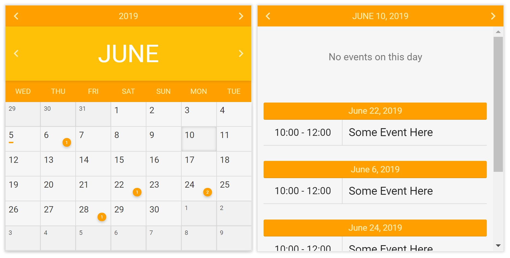

# 📅 JS Calendar Library
[![License][license-badge]][license-badge-url]

> Simple, lightweight, stylish calendar + organizer JavaScript Library

[Installation](#-install) &mdash;
[Basic Usage](#-basic-usage) &mdash;
[Examples](#-examples) &mdash;
[Doc](#-doc) &mdash;
[Screenshots](#-screenshots)

## 🌏 Browser Support
|  Chrome |  Internet Explorer |  Edge |  Safari |  Firefox |
| :---------: | :---------: | :---------: | :---------: | :---------: |
| Yes | 10+ | Yes | Yes | Yes |

## 💾 Install

There are multiple ways to install the calendar library

* Via CDN:
<!-- Replace the link with rawgit.com CDN link -->
```html
<head>
    <link href="https://raw.githubusercontent.com/nizarmah/calendar-javascript-lib/master/calendarorganizer.min.css" rel="stylesheet" />
</head>

<body>
    <!-- Stick script at the end of the body -->
    <script src="https://raw.githubusercontent.com/nizarmah/calendar-javascript-lib/master/calendarorganizer.min.js"></script>
    <script>
        /* Fill with whatever your dreams desire */
    </script>
</body>
```

* Via download and self-hosting:
Download the [minified JavaScript file][js-minified-download] and [minified CSS file][css-minified-download]
```html
<!-- Insert in <head> -->
<link href="calendarorganizer.min.css" rel="stylesheet" />

<!-- Insert before you own <script> tag-->
<script src="calendarorganizer.min.js"></script>
```

## 🔨 Basic Usage
### HTML
Place 2 `<div>`'s where you want the calendar to be placed

```html
<body>
...
<div id="calendarContainer"></div>
<div id="organizerContainer"></div>
...
</body>
```

### JavaScript
```javascript
// Basic config
var calendar = new Calendar("calendarContainer", "small",
                            [ "Monday", 3 ],
                            [ "#ffc107", "#ffa000", "#ffffff", "#ffecb3" ]
                            {
                                days: [ "Sunday", "Monday", "Tuesday", "Wednesday", "Thursday", "Friday",  "Saturday" ],
                                months: [ "January", "Feburary", "March", "April", "May", "June", "July", "August", "September", "October", "November", "December" ],
                                indicator: false,
                                placeholder: "<span>Custom Placeholder</span>"
                            });

var data = {
            2017: {
                12: {
                    25: [
                        {
                            startTime: "00:00",
                            endTime: "24:00",
                            text: "Christmas Day"
                        }
                    ]
                }
            };

var organizer = new Organizer("organizerContainer", calendar, data);
```
> Want to know how to customize your data? [Check out the docs](#-doc)

## 📓 Doc

### Calendar Object

The calendar item, used to display days, months, and years

```javascript
var calendar = new Calendar("calendarContainer", // HTML container ID,                        Required
                            "small",             // Size: (small, medium, large)              Required
                            ["Sunday", 3],       // [ Starting day, day abbreviation length ] Required
                            [ "#ffc107",         // Primary Color                             Required
                              "#ffa000",         // Primary Dark Color                        Required
                              "#ffffff",         // Text Color                                Required
                              "#ffecb3" ],       // Text Dark Color                           Required
                            
                            // Following is optional
                            {
                                days: [ "Sunday", "Monday", "Tuesday", "Wednesday", "Thursday", "Friday",  "Saturday" ],
                                months: [ "January", "Feburary", "March", "April", "May", "June", "July", "August", "September", "October", "November", "December" ],
                                indicator: false,
                                placeholder: "<span>Custom Placeholder</span>"
                            });
```
> When changing days, the starting day *must* match one of the days given

#### Calendar OnClickListeners
> If you are using the organizer, please use the [Organizer OnClickListener](#organizer-onclicklisteners). If not, use the following
```javascript
// Days Block click listener
calendar.setOnClickListener('days-blocks',
    // Called when a day block is clicked
    function () {
        console.log("Day block clicked");
    }
);

// Month Slider (Left and Right Arrow) Click Listeners
calendar.setOnClickListener('month-slider',
    // Called when the month left arrow is clicked
    function () {
        console.log("Month back slider clicked");
    },
    // Called when the month right arrow is clicked
    function () {
        console.log("Month next slider clicked");
    }
);

// Year Slider (Left and Right Arrow) Click Listeners
calendar.setOnClickListener('year-slider',
    // Called when the year left arrow is clicked
    function () {
        console.log("Year back slider clicked");
    },
    // Called when the year right arrow is clicked
    function () {
        console.log("Year next slider clicked");
    }
);
```

### Organizer Object

The organizer object, used to display events

```javascript
var organizer = new Organizer("organizerContainer", // Organizer container id                      Required
                              calendar,             // Calendar item                               Required
                              data);                // Events data (Must follow specified format)  Required
```

#### Event Format
```javascript
{
    startTime: "00:00",
    endTime: "24:00",
    text: "Christmas Day"
}
```
> Since starting and ending time are strings, 24 hour time is not required. You can just use "12:00am" and "12:00pm" instead of "00:00" and "24:00"

#### Data Format
```javascript
{
    year: {
        month: {
            day: [ events ]
        }
    }
}

// Example
var data = {
    // December 25, 2017
    2017: {
        12: {
            25: [
                // Christmas Day
                {
                    startTime: "00:00",
                    endTime: "24:00",
                    text: "Christmas Day"
                },
                // Christmas Dinner
                {
                    startTime: "5:00pm",
                    endTime: "11:00pm",
                    text: "Christmas Dinner"
                }
            ]
        }
    }
}
```

#### Organizer OnClickListener
> Do not use this if `organizer` is not declared. Use the [Calendar OnClickListeners](#calendar-onclicklisteners) instead

```javascript
// Days Block click listener
organizer.setOnClickListener('days-blocks',
    // Called when a day block is clicked
    function () {
        console.log("Day block clicked");
    }
);

// Month Slider (Left and Right Arrow) Click Listeners
organizer.setOnClickListener('month-slider',
    // Called when the month left arrow is clicked
    function () {
        console.log("Month back slider clicked");
    },
    // Called when the month right arrow is clicked
    function () {
        console.log("Month next slider clicked");
    }
);

// Year Slider (Left and Right Arrow) Click Listeners
organizer.setOnClickListener('year-slider',
    // Called when the year left arrow is clicked
    function () {
        console.log("Year back slider clicked");
    },
    // Called when the year right arrow is clicked
    function () {
        console.log("Year next slider clicked");
    }
);
```

## Examples
### Using Ajax
Want to retrieve your events from an API? Use the `onMonthChange` function to dynamically add dates

```javascript
organizer.onMonthChange = function (callback) {
    var xhttp = new XMLHttpRequest();
    xhttp.onreadystatechange = function() {
        if (this.readyState == 4 && this.status == 200) {
            // TODO : Change the Organizer's Data to the new Data
            // TODO : that you just grabbed from the Ajax Request

            organizer.data = this.responseText;

            // TODO : Call the Callback to display the Data
            callback();
        }
    };
    xhttp.open("GET", "someurl.json", true);
    xhttp.send();
};
```
> Check out *ajax_organizer.html* in the examples folder for a better demonstration

## 🖼️ Screenshots


[js-minified-download]: https://raw.githubusercontent.com/nizarmah/calendar-javascript-lib/master/calendarorganizer.min.js
[css-minified-download]: https://raw.githubusercontent.com/nizarmah/calendar-javascript-lib/master/calendarorganizer.min.css


[license-badge]: https://img.shields.io/npm/l/three.svg
[license-badge-url]: ./LICENSE
